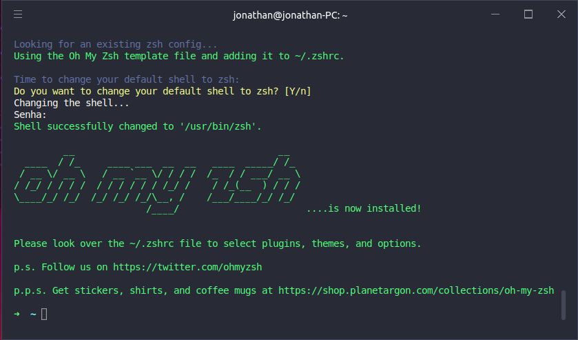

# Awesome Ubuntu Terminal (Under construction)
The best terminal configuration for Ubuntu

### Install Dependencies
```sudo apt install curl zsh git vim```

### Install Hyper Terminal
https://hyper.is/#installation

Download .deb file and ```sudo dpkg -i xxxx.deb```

### Install Oh My Zsh

```sh -c "$(curl -fsSL https://raw.github.com/ohmyzsh/ohmyzsh/master/tools/install.sh)"```



### Install Dracula Theme

### Install Fira Code Font
https://github.com/tonsky/FiraCode/wiki/Linux-instructions#installing-with-a-package-manager
```sudo apt install fonts-firacode```

Add Fira Code to Hyper configuration and change font size if you want


### Install Spaceship Theme

